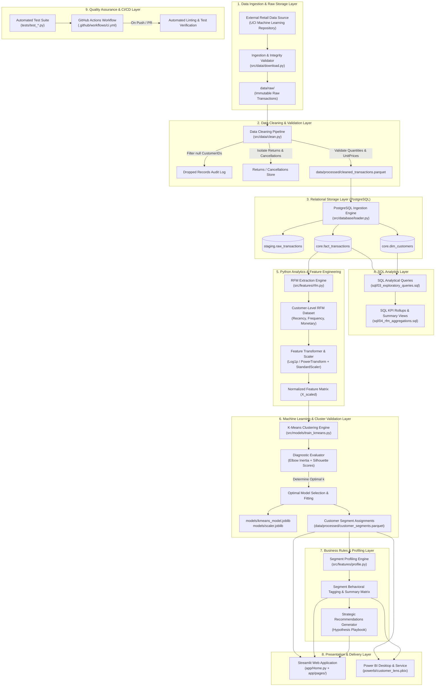

# Technical Architecture Document

## CustomerLens — Customer Segmentation & Targeted Marketing Analytics

---

### 1. Overall Architecture

CustomerLens is designed as a modular, decoupled, and reproducible end-to-end customer analytics platform. The architecture bridges modern relational database modeling, scientific Python feature engineering, unsupervised machine learning, and multi-tier presentation tools (interactive Streamlit web application and Power BI executive dashboards).

#### 1.1 Architectural Principles
- **Separation of Concerns:** Strict decoupling between data ingestion, validation, analytical database storage, machine learning computation, and user interface delivery.
- **Data Immutability:** Raw transactional datasets are preserved in an unmodifiable state; all transformations generate auditable, versioned processed datasets.
- **Reproducibility:** Deterministic pipeline execution enforced through fixed random seeds, pinned dependencies, declarative SQL migrations, and automated unit testing.
- **Empirical Rigor:** Machine learning clusters and analytical findings are strictly derived from empirical data without hard-coded segment counts or fabricated uplift claims.
- **Security & Secret Isolation:** Database credentials and system environment parameters are loaded dynamically from environment variables, strictly isolating sensitive configurations from version control.

#### 1.2 End-to-End Data Pipeline Flow
The data lifecycle flows sequentially through thirteen distinct platform stages:

```
[Raw Dataset]
       │
       ▼
[Data Validation]
       │
       ▼
[Data Cleaning & Hygiene]
       │
       ▼
[PostgreSQL Relational Layer]
       │
       ▼
[SQL Analytics & Aggregations]
       │
       ▼
[Python Feature Engineering]
       │
       ▼
[RFM Metric Computation]
       │
       ▼
[Feature Scaling & Preprocessing]
       │
       ▼
[K-Means Clustering Engine]
       │
       ▼
[Cluster Validation & Diagnostics]
       │
       ▼
[Business Segment Naming & Profiling]
       │
       ▼
[Dashboards & Applications] ─── (Streamlit UI & Power BI)
       │
       ▼
[CI/CD & Cloud Deployment]
```

#### 1.3 Data Layer Classification
To prevent data contamination and ensure clear system boundaries, data assets are strictly segregated into five distinct layers:

| Layer | Physical Location | Schema / Format | Description & Access Pattern |
| :--- | :--- | :--- | :--- |
| **1. Raw Data Layer** | `data/raw/` | Compressed CSV / Excel / XLSX | Original, immutable transactional dumps. Strictly read-only; excluded from Git. |
| **2. Transformed Data Layer** | `data/processed/` | Columnar Apache Parquet / Clean CSV | Deduplicated, cleaned, and validated transaction-level records. |
| **3. Analytical Tables Layer** | PostgreSQL (`customer_lens` DB) | Relational Schemas (`staging`, `core`, `mart`) | Structured tables containing indexed transactional facts, customer dimensions, and RFM aggregates. |
| **4. ML Outputs Layer** | `data/processed/`, `models/` | Parquet tables, Joblib serialized models | Scaled feature arrays, trained K-Means estimators, inertia/silhouette diagnostic metrics, and customer cluster label assignments. |
| **5. Presentation Layer** | `app/`, `powerbi/` | In-memory DataFrames, Plotly specs, `.pbix` models | Aggregated KPI matrices, dynamic interactive plots, DAX measure calculations, and cohort export payloads. |

---

### 2. Architecture Diagram



---

### 3. Data Ingestion Layer

The Data Ingestion Layer is responsible for fetching, verifying, and storing raw transactional data from external repositories into the local environment.

#### 3.1 Responsibilities
- Secure retrieval of original archive files (e.g., UCI Online Retail `.xlsx` or `.csv`).
- File integrity checking via SHA-256 cryptographic hashing against known source checksums.
- Validation of raw archive boundaries (file size, uncompressed format verification, encoding detection).
- Recording ingestion metadata (source URL, retrieval timestamp, byte length, initial row and column count).

#### 3.2 Design Specifications
- **Script Location:** `src/data/ingest.py`
- **Configuration:** Source URLs, timeouts, and target directory paths defined in environment variables and project configuration files.
- **Failure Recovery:** Exponential backoff retry logic for external network requests; failsafe assertions preventing partial file overwrites.

---

### 4. Raw Data Layer

The Raw Data Layer acts as the immutable system of record for all downstream processing.

#### 4.1 Responsibilities
- Preserves transactional data in its native, unmanipulated format.
- Guarantees strict immutability: analytical processes are granted read-only permissions; write/delete operations from downstream scripts are programmatically forbidden.
- Encapsulates raw datasets inside `data/raw/`, strictly ignored by version control through [.gitignore](file:///c:/Users/divya/OneDrive/Desktop/Customer_Lens/.gitignore).

#### 4.2 Raw Schema Specification (Expected UCI Online Retail)
- `InvoiceNo` (`VARCHAR(20)`): Unique transaction identifier. Alphanumeric; values beginning with 'C' denote cancellations.
- `StockCode` (`VARCHAR(20)`): Alphanumeric item code identifying the catalog product.
- `Description` (`VARCHAR(255)`): Plain text product title/description.
- `Quantity` (`INTEGER`): Number of product units per transaction line item.
- `InvoiceDate` (`TIMESTAMP`): Transaction date and time.
- `UnitPrice` (`NUMERIC(10, 3)`): Unit price of the merchandise in GBP.
- `CustomerID` (`NUMERIC` / `VARCHAR(20)`): Unique customer identifier.
- `Country` (`VARCHAR(100)`): Country of billing/shipping.

---

### 5. Cleaning & Validation Layer

The Cleaning Layer enforces data quality standards and structural hygiene, resolving transactional anomalies before loading into relational tables or feature pipelines.

#### 5.1 Cleaning Workflow & Rules Engine
1. **Deduplication:** Remove exact duplicate transaction rows caused by network double-posts or logging re-tries.
2. **Customer Identification Triage:**
   - Detect records with null/missing `CustomerID`.
   - Log total count and monetary volume of anonymous transactions.
   - Separate anonymous transactions into a dedicated reporting view (useful for store-level sales reconciliations) while excluding them from the customer-grain RFM segmentation model.
3. **Transaction Status Categorization:**
   - Identify cancelled invoices (prefix 'C' in `InvoiceNo`) and negative `Quantity` values.
   - Isolate cancellations into a returns fact table to prevent distortion of completed purchase monetary sums.
4. **Price & Quantity Integrity Checks:**
   - Filter records with non-positive unit prices (`UnitPrice <= 0`).
   - Flag non-merchandise administrative codes (e.g., `POST` for postage, `D` for discount, `CRUK`, `BANK CHARGES`, `M` for manual adjustments) and route them to administrative log tables.
5. **Data Typing & Persistence:**
   - Cast fields into typed representations (`int64` for identifiers, `datetime64[ns]` for timestamps, `float64` for financial values).
   - Write sanitized output to `data/processed/cleaned_transactions.parquet` using Snappy compression for high I/O throughput.

---

### 6. PostgreSQL Database Layer

The PostgreSQL database layer provides relational persistence, transactional integrity, and optimized SQL querying capabilities for enterprise analytics.

#### 6.1 Database Schema Architecture
The database (`customer_lens`) is organized into three distinct schemas:

```
customer_lens/
├── staging/
│   └── raw_transactions          (Raw, untyped ingestion dump)
│
├── core/
│   ├── fact_transactions         (Cleaned, validated purchase line items)
│   ├── fact_returns              (Isolated cancellations and refunds)
│   ├── dim_customers             (Unique customer profiles and lifetime totals)
│   └── dim_products              (Catalog stock codes and descriptions)
│
└── mart/
    ├── customer_rfm_metrics      (Computed R, F, M metrics per customer)
    └── customer_segments         (Final cluster labels and behavioral tags)
```

#### 6.2 Table DDL & Relational Constraints
- **`core.fact_transactions`**:
  - `transaction_id` (`BIGSERIAL PRIMARY KEY`)
  - `invoice_no` (`VARCHAR(20) NOT NULL`)
  - `stock_code` (`VARCHAR(20) NOT NULL`)
  - `description` (`VARCHAR(255)`)
  - `quantity` (`INTEGER NOT NULL CHECK (quantity > 0)`)
  - `invoice_date` (`TIMESTAMP NOT NULL`)
  - `unit_price` (`NUMERIC(10, 2) NOT NULL CHECK (unit_price > 0)`)
  - `customer_id` (`VARCHAR(20) NOT NULL`)
  - `country` (`VARCHAR(100) NOT NULL`)
  - `line_total` (`NUMERIC(12, 2) GENERATED ALWAYS AS (quantity * unit_price) STORED`)

#### 6.3 Performance Optimization & Indexing Strategy
- B-Tree Index on `core.fact_transactions(customer_id)` for high-speed customer grouping.
- B-Tree Index on `core.fact_transactions(invoice_date)` for rolling time-window aggregations.
- Composite Index on `core.fact_transactions(customer_id, invoice_date)` for recency ranking.
- Unique Index on `mart.customer_rfm_metrics(customer_id)` ensuring strict 1:1 customer mapping.

---

### 7. SQL Analytics Layer

The SQL Analytics Layer implements analytical aggregation logic directly against the relational database engine, answering foundational operational and business questions before modeling.

#### 7.1 Script Organization
- `sql/01_create_schemas_and_tables.sql`: DDL definitions, primary keys, checks, and foreign keys.
- `sql/02_load_data.sql`: Staging copy commands and ETL transformations from `staging` to `core`.
- `sql/03_exploratory_queries.sql`: Baseline business metrics (Total Revenue, Total Customers, Total Orders, Average Order Value, Monthly Active Customers).
- `sql/04_rfm_aggregations.sql`: SQL-native implementation of RFM feature computation using Common Table Expressions (CTEs) and window functions.

#### 7.2 Core SQL Metrics Implemented
- Gross Store Revenue and Average Order Value (AOV) across time windows.
- Revenue concentration analysis (Pareto distribution: top decile spenders vs. store total).
- Monthly purchase frequency and cohort retention matrices via SQL self-joins.

---

### 8. Python Analytics Layer

The Python Analytics Layer serves as the programmatic orchestration engine for numerical computing, statistical testing, and data flow execution.

#### 8.1 Package Architecture (`src/`)
```
src/
├── __init__.py
├── config.py                 # Centralized path, database, and hyperparameter configs
├── data/
│   ├── __init__.py
│   ├── ingest.py             # Download & file verification routines
│   └── clean.py              # Data hygiene, filtering, and Parquet serialization
├── database/
│   ├── __init__.py
│   ├── connection.py         # SQLAlchemy engine & psycopg2 connection pools
│   └── loader.py             # Bulk database insertion and migration executors
├── features/
│   ├── __init__.py
│   ├── rfm.py                # RFM computation, snapshot logic, aggregation
│   └── transforms.py         # Skewness diagnostics, Log1p/PowerTransform, Scalers
├── models/
│   ├── __init__.py
│   ├── train_kmeans.py       # K-Means grid runner, inertia/silhouette evaluator
│   └── predict.py            # Inference engine applying trained models to new data
├── utils/
│   ├── __init__.py
│   ├── logger.py             # Standardized logging formatting
│   └── metrics.py            # Evaluation helper functions
└── visualization/
    ├── __init__.py
    └── plots.py              # Plotly and Seaborn reusable figure builders
```

#### 8.2 Execution Decoupling: Notebooks vs. Production Modules
- **`notebooks/`**: Used strictly for iterative exploratory data analysis, visual prototyping, hypothesis formulation, and draft chart creation.
- **`src/`**: All production-grade analytical functions, feature calculations, and model estimators are refactored into modular, testable Python classes and functions. Notebooks import from `src/` rather than defining standalone business logic.

---

### 9. RFM Feature Engineering Layer

The RFM Feature Engineering Layer aggregates granular transaction lines into a single, standardized behavioral feature vector for each individual customer.

#### 9.1 Mathematical Formulation
1. **Dynamic Reference Snapshot Date ($T_{\text{snapshot}}$):**
   $$T_{\text{snapshot}} = \max(\text{InvoiceDate}) + 1\text{ day}$$
   Evaluated dynamically from the verified dataset to maintain temporal consistency without manual date hard-coding.
2. **Recency ($R$):**
   $$R_i = \text{datediff}\left(T_{\text{snapshot}}, \max(\text{InvoiceDate}_i)\right)$$
   Represents the number of elapsed calendar days since customer $i$'s most recent completed order.
3. **Frequency ($F$):**
   $$F_i = \text{Count of unique completed InvoiceNo for customer } i$$
   Measures distinct repeat purchase occasions, avoiding inflation from multiple line items on the same order.
4. **Monetary Value ($M$):**
   $$M_i = \sum_{j=1}^{N_i} (\text{Quantity}_{i,j} \times \text{UnitPrice}_{i,j})$$
   Total net financial expenditure across all valid purchases by customer $i$.

#### 9.2 Distributional Evaluation & Feature Transformation
- **Skewness Diagnostics:** E-commerce RFM metrics typically exhibit extreme positive right-skewness and heavy tails (high Kurtosis).
- **Transformation Pipeline:**
  - Evaluate skewness coefficient ($G_1$) for $R$, $F$, and $M$.
  - Apply monotonic transformation:
    $$x_{\text{transformed}} = \log_e(x + 1)$$
    or `PowerTransformer(method='yeo-johnson')` to stabilize variance and approximate normal distributions.
  - Apply `StandardScaler` to ensure zero mean ($\mu = 0$) and unit variance ($\sigma = 1$) across transformed features:
    $$z = \frac{x_{\text{transformed}} - \mu}{\sigma}$$
  - Preserves Euclidean distance integrity, ensuring Monetary spend does not dominate Recency and Frequency during clustering.

---

### 10. Machine Learning Layer

The Machine Learning Layer identifies natural behavioral groupings among customers using unsupervised clustering algorithms.

#### 10.1 Algorithm Selection: K-Means Clustering
- Implemented via `sklearn.cluster.KMeans`.
- **Initialization:** `k-means++` algorithm to accelerate convergence and avoid sub-optimal local minima.
- **Hyperparameter Parameters:** Deterministic `random_state = 42`, `n_init = 10`, `max_iter = 300`.

#### 10.2 Empirical Cluster Selection Workflow
No cluster count ($k$) is assumed prior to model evaluation. The platform conducts a systematic grid evaluation across $k \in [2, 10]$:

```
For k in 2..10:
   1. Fit KMeans(n_clusters=k, random_state=42) on Normalized RFM Matrix
   2. Compute Within-Cluster Sum of Squares (Inertia / WCSS)
   3. Compute Average Silhouette Coefficient across all samples
   4. Generate Silhouette Coefficient plots per cluster to evaluate cluster balance
```

- **Elbow Evaluation:** Locate the point of diminishing returns where incremental reduction in inertia flattens.
- **Silhouette Analysis:** Identify $k$ maximizing mean silhouette score:
  $$s(i) = \frac{b(i) - a(i)}{\max(a(i), b(i))}$$
  where $a(i)$ is mean intra-cluster distance and $b(i)$ is mean nearest-cluster distance.
- **Selection Decision:** Select optimal $k$ balancing mathematical compactness, separation, and business interpretability.

#### 10.3 Model Serialization
- Serialized trained estimator: `models/kmeans_model.joblib`.
- Serialized fitted preprocessor: `models/scaler.joblib`.
- Allows reproducible scoring of incoming customer transaction batches without re-fitting.

---

### 11. Cluster Profiling Layer

The Cluster Profiling Layer translates raw mathematical cluster centroids back into human-interpretable retail metrics.

#### 11.1 Inverse Transformation & Summary Aggregations
- Map assigned cluster labels back to unscaled, original-currency customer records.
- Calculate robust descriptive statistics for each cluster:
  - **Recency:** Median days, Mean days, Min, Max.
  - **Frequency:** Median order count, Mean orders, Interquartile Range (IQR).
  - **Monetary:** Median spend, Mean spend, Total segment contribution to overall store revenue.
  - **Volume:** Total unique customer headcount and proportion of active customer base.

#### 11.2 Segment Indexing & Statistical Separation
- Compute relative index metrics comparing segment averages against overall population averages:
  $$\text{Index}_{\text{Metric}} = \left( \frac{\overline{X}_{\text{Segment}}}{\overline{X}_{\text{Population}}} \right) \times 100$$
- Conduct statistical hypothesis tests (e.g., Kruskal-Wallis or ANOVA) to confirm that differences across discovered clusters are statistically significant.

---

### 12. Business Rules & Segment Naming Layer

The Business Rules Layer maps numerical clusters to operational customer personas, following strict governance to prevent unsubstantiated claims.

#### 12.1 Segment Persona Assignment Framework
Segment titles are assigned strictly *post-analysis* based on observed RFM coordinates:

```
Observed Empirical Profile                  Assigned Descriptive Persona
──────────────────────────────────────────────────────────────────────────
Low Recency, High Frequency, High Spend  →  High-Value Active Champions
Low Recency, Low Frequency, Modest Spend →  Recent New Buyers
Modest Recency, Modest Freq, Modest Spend→  Steady Regular Shoppers
High Recency, High Freq, High Spend      →  At-Risk High-Value Spenders
High Recency, Low Freq, Low Spend        →  Dormant Inactive Customers
```

*(Exact labels and mappings will be finalized after empirical cluster profiling in subsequent phases.)*

#### 12.2 Strategic Recommendation Framework (Hypothesis Playbook)
Actionable marketing interventions are explicitly cataloged as **testable hypotheses**:

| Segment Archetype | Strategic Focus | Marketing Intervention Hypothesis | Testing & Validation Plan |
| :--- | :--- | :--- | :--- |
| **High-Value Champions** | Retention & Advocacy | Enrolling in exclusive VIP loyalty programs and offering early access to new lines will sustain order velocity without heavy price discounting. | Test VIP early access vs. non-incentivized control over a 60-day window. |
| **Recent New Buyers** | Second-Purchase Onboarding | Sending automated product discovery guides and cross-category welcome incentives within 14 days will shorten inter-purchase intervals. | A/B test welcome email sequences with product guides against baseline order receipts. |
| **At-Risk High-Value** | Churn Prevention / Reactivation | Deploying personalized win-back offers and dedicated customer service surveys will reactivate lapsed high-spend accounts. | Test personalized reactivation offers against standard promotional emails. |
| **Dormant Inactive** | Re-engagement or Deprioritization | Testing deep clearance promotions before decreasing costly direct-mail or SMS marketing spend. | Evaluate unsubscribe rates and reactivation ROI relative to message delivery costs. |

---

### 13. Visualization Layer

The Visualization Layer provides standardized, high-clarity graphical components across both analytical notebooks and production web applications.

#### 13.1 Visual Standards & Toolkit
- **Static Graphics (Notebooks & Docs):** Built with `matplotlib` and `seaborn` for publication-quality charts.
- **Interactive Visualizations (Web Application):** Built with `plotly.express` and `plotly.graph_objects` to enable dynamic zooming, hover tooltips, and segment slicing.
- **Color Architecture:** Cohesive, colorblind-accessible color palettes ensuring each customer segment maintains identical color assignment across all charts and pages.

#### 13.2 Core Visualization Components
- **3D RFM Cluster Visualizer:** Interactive 3D scatter plot plotting Recency ($X$), Frequency ($Y$), and Monetary ($Z$) on logarithmic axes.
- **Inertia & Silhouette Diagnostic Plots:** Dual-axis chart highlighting the elbow point alongside average silhouette scores across $k \in [2, 10]$.
- **Segment Revenue vs. Customer Count Treemaps:** Visualizing revenue contribution versus cohort size.
- **RFM Metric Radar Charts:** Centroid comparison showing normalized profiles of each segment across behavioral dimensions.

---

### 14. Streamlit Application Layer

The Streamlit Application Layer provides an interactive, accessible analytics portal for business stakeholders, growth teams, and executives.

#### 14.1 Architecture & Page Structure
The application is structured as a multi-page interface rooted in `app/`:

```
app/
├── Home.py                       # Executive Overview, platform summary, global KPIs
├── pages/
│   ├── 1_Data_Overview.py        # Dataset health, summary distributions, sample explorer
│   ├── 2_RFM_Distributions.py    # R, F, M histograms, boxplots, skewness analysis
│   ├── 3_Customer_Segments.py    # 2D/3D cluster exploration, segment comparisons
│   └── 4_Marketing_Strategy.py   # Segment personas, recommendation cards, cohort export
└── components/
    ├── __init__.py
    ├── metrics.py                # Reusable KPI metric card widgets
    ├── charts.py                 # Plotly figure generation wrappers
    └── sidebar.py                # Shared global filter controls (date range, segment filter)
```

#### 14.2 Performance & State Management
- **Data Caching:** Heavy datasets and trained models are cached using `@st.cache_data` and `@st.cache_resource` to ensure sub-second page transition speeds.
- **Session State:** Segment selection and filter states are maintained across pages using `st.session_state`.
- **Export Facility:** Integrated CSV export component allowing marketing operators to download filtered lists of Customer IDs mapped to specific segment campaigns.

---

### 15. Power BI Layer

The Power BI Layer delivers an executive-grade Business Intelligence dashboard suitable for commercial leadership and recurring business reviews.

#### 15.1 Relational Star Schema
The Power BI data model imports processed analytical tables into a structured Star Schema:

```
         ┌────────────────────────┐
         │      DimDate           │
         └──────────┬─────────────┘
                    │ 1
                    │
                    │ *
┌──────────────┐ *  │    * ┌────────────────────────┐
│ DimCustomer  ├───┼────┼─┤ FactTransactions       │
└──────┬───────┘   │       └────────────────────────┘
       │ *         │
       │           │
       │ 1         │
┌──────┴───────────┴┐
│   DimSegment      │
└───────────────────┘
```

#### 15.2 Explicit DAX Measures
All metrics are implemented as explicit, reusable DAX calculations in a dedicated `_Measures` table:

```dax
Total Revenue = 
SUM(FactTransactions[LineTotal])

Total Orders = 
DISTINCTCOUNT(FactTransactions[InvoiceNo])

Total Customers = 
DISTINCTCOUNT(DimCustomer[CustomerID])

Average Order Value = 
DIVIDE([Total Revenue], [Total Orders], 0)

Segment Revenue Contribution % = 
DIVIDE(
    [Total Revenue], 
    CALCULATE([Total Revenue], ALL(DimSegment)), 
    0
)

Segment Customer Share % = 
DIVIDE(
    [Total Customers], 
    CALCULATE([Total Customers], ALL(DimSegment)), 
    0
)
```

#### 15.3 Dashboard Viewports
- **Page 1: Executive KPI Summary:** Top-level revenue metrics, transaction trends, country-level geographic choropleth, and high-level segment split.
- **Page 2: Customer Segmentation Deep-Dive:** Cluster scatter visualizers, segment comparison matrix (AOV, Avg Recency, Avg Frequency), and revenue contribution Pareto charts.
- **Page 3: Customer Lookup & Cohort Explorer:** Detailed customer table with slicers for individual segment auditing.

---

### 16. Testing Layer

The Testing Layer enforces software engineering rigor and data pipeline integrity through automated test suites executed via `pytest`.

#### 16.1 Test Suite Organization (`tests/`)
```
tests/
├── __init__.py
├── conftest.py                   # Shared synthetic fixtures, test DataFrames, temp directories
├── test_cleaning.py              # Tests for null handling, returns isolation, price checks
├── test_rfm.py                   # Tests for snapshot calculation, R, F, M mathematical formulas
├── test_transforms.py            # Tests for log scaling, standard scaler output shapes
└── test_models.py                # Tests for K-Means fitting determinism, cluster labels
```

#### 16.2 Key Test Scenarios
- **Data Cleaning Assertions:** Verify that records with missing `CustomerID` are quarantined; confirm that cancelled invoices (`C` prefix) and non-positive prices are filtered correctly.
- **RFM Formula Verification:** Test a synthetic 3-customer transactional fixture with known dates and line items to ensure $R$, $F$, and $M$ calculations match mathematically verified expected values.
- **Deterministic Clustering:** Assert that fitting K-Means with fixed `random_state = 42` on identical inputs produces identical cluster labels and centroids.

---

### 17. CI/CD & Deployment Architecture

The CI/CD Layer automates quality verification and orchestrates zero-downtime deployment of presentation artifacts.

#### 17.1 GitHub Actions Workflow (`.github/workflows/ci.yml`)
- **Trigger Events:** Automated execution on every `push` to `main` and all `pull_request` events targeting `main`.
- **Pipeline Stages:**
  1. **Checkout Code:** Pulls repository state.
  2. **Set up Python:** Provisions Python 3.10 runtime.
  3. **Cache Dependencies:** Caches `pip` cache directory to minimize pipeline runtimes.
  4. **Install Dependencies:** Installs packages specified in `requirements.txt`.
  5. **Linting & Code Style:** Runs `flake8` to enforce PEP 8 standards and syntax correctness.
  6. **Automated Testing:** Runs `pytest tests/ -v --maxfail=1` to ensure all data transformations and feature algorithms pass.

#### 17.2 Deployment Topologies
- **Streamlit Application Deployment:**
  - Deployed to **Streamlit Community Cloud** directly connected to the GitHub repository `DIVYANK6767/Customer_Lens`.
  - Automated deployment triggers upon verified merge to `main`.
  - Secrets and database credentials configured via the Streamlit Cloud Secrets Manager (mirroring `.env.example`).
- **Power BI Distribution:**
  - Local authoring in Power BI Desktop (`powerbi/customer_lens.pbix`).
  - Published to Power BI Service workspace for web-based interactive viewing and executive sharing.
- **Local Development Environment:**
  - Virtual environment managed via `.venv`.
  - Database hosted in local or containerized PostgreSQL instance.
  - Streamlit run locally via `streamlit run app/Home.py`.
